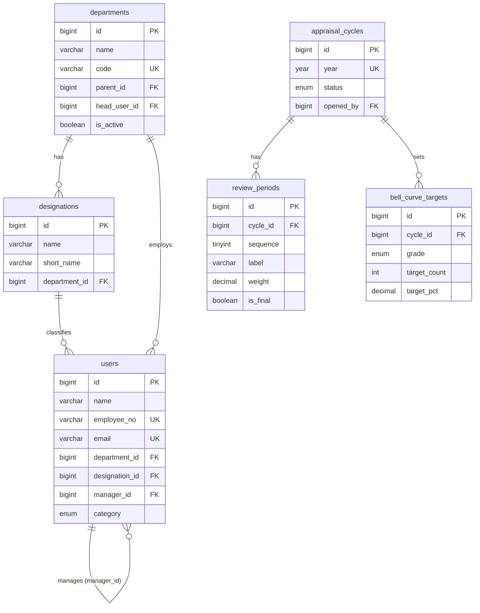
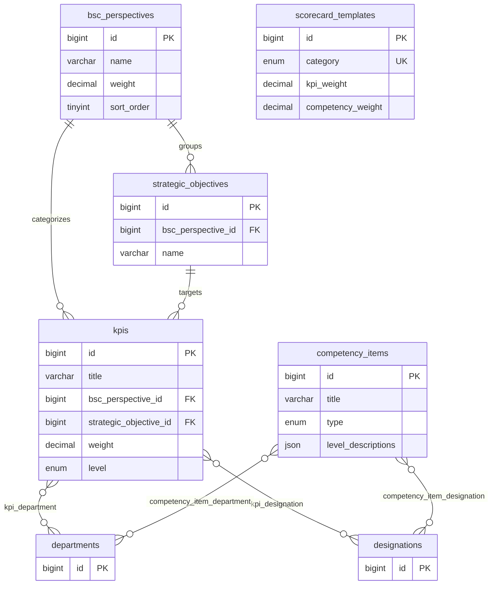
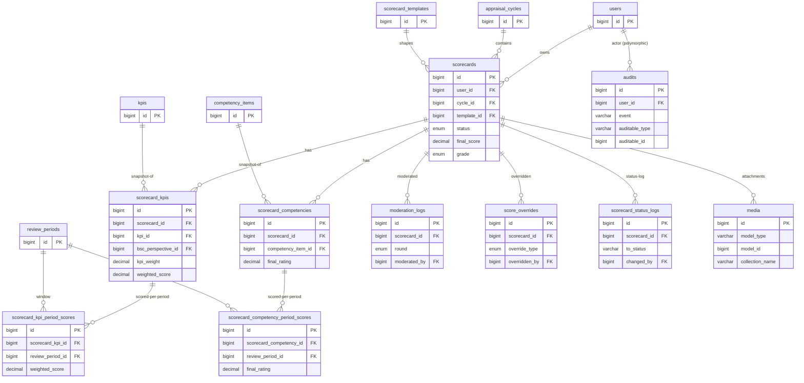

# PNSB BSC KPI — Database Design

> **Reflects the actually-built schema** (verified against the live MySQL `information_schema`).
> Stack: Laravel 13 + Livewire 4 (Volt) + MySQL. Spatie Permission for roles; Spatie Media Library for attachments; owen-it/laravel-auditing for the audit trail.
> Last updated: 2026-06-30 (added the `audits` table + audit-trail feature)

---

## Design Principles

- All scoring rules are **ALP Board ketetapan** — stored as data (templates, perspective weights, bell-curve targets), not hardcoded.
- `manager_id` chain on `users` drives the entire review hierarchy.
- **Snapshot architecture**: `scorecard_kpis` / `scorecard_competencies` copy the KPI/competency definition (title, uom, type…) at assignment time, so a historical scorecard stays stable even if the library is later edited. `kpi_id` / `competency_item_id` are kept (nullable) as a soft link back to the source.
- **Period-based scoring**: each scorecard KPI/competency is scored once per `review_period` (Mid-Year, Year-End), then aggregated into the line on `scorecard_kpis` / `scorecard_competencies`, then into the scorecard totals.
- Status progression is one-way and logged on every change (`scorecard_status_logs`).
- Enums for ALP-locked values; VARCHAR for anything HR might extend later.
- `softDeletes` on the master/reference tables (users, departments, designations, kpis, scorecards, cycles, perspectives, templates, competency_items, review_periods, strategic_objectives, bell_curve_targets).
- **General audit trail**: `owen-it/laravel-auditing` records create/update/delete on all domain & config models, plus authentication events (login/logout/failed-login), into the polymorphic `audits` table. The hand-rolled `moderation_logs` / `score_overrides` / `scorecard_status_logs` remain the **domain-specific** trails and are deliberately **not** double-audited.

---

## Roles & Categories

**Roles** are managed by **Spatie Permission** (`roles`, `permissions`, `model_has_roles`, `model_has_permissions`, `role_has_permissions`) — there is **no `role` column** on `users`. The 5 system roles:

| Role                   | Purpose                                                         | Appraised?               |
| ---------------------- | --------------------------------------------------------------- | ------------------------ |
| `super-admin`        | Full system admin; stands in for HR at moderation/lock          | No                       |
| `hr-admin`           | HR operations, moderation MOD1, lock                            | No                       |
| `executive-director` | CEO / KPE — top of chain, runs moderation MOD2                 | Yes (CEO template)       |
| `division-head`      | Ketua Bahagian — reviews subordinates**and** is reviewed | Yes (Executive template) |
| `staff`              | Executive or Support employees                                  | Yes                      |

**`users.category`** (`ceo` / `executive` / `support`) is separate from role — it selects the scorecard template / scoring formula. A `division-head` is `category = executive`. Admin roles (`super-admin`, `hr-admin`) are excluded from scorecard generation regardless of category.

---

## Tables

### 1. `departments`

```
id            bigint PK
name          varchar(150)
code          varchar(50) UNIQUE
parent_id     bigint NULL → departments.id
head_user_id  bigint NULL → users.id (set after users created)
is_active     boolean
deleted_at, timestamps
```

### 2. `designations`  *(new since planning — replaces free-text job_title)*

```
id            bigint PK
name          varchar(150)
short_name    varchar(50)          -- e.g. CEO, FM, FE, ITM, HRM
department_id bigint → departments.id
description   text NULL
is_active     boolean
deleted_at, timestamps
```

### 3. `users`

```
id              bigint PK
name            varchar(255)
employee_no     varchar(50) UNIQUE
email           varchar(255) UNIQUE
department_id   bigint NULL → departments.id
designation_id  bigint NULL → designations.id
manager_id      bigint NULL → users.id   (self-referential; NULL = top of chain / admins)
category        enum('ceo','executive','support')   -- drives scoring template
is_active       boolean
email_verified_at timestamp NULL
password        varchar(255)
remember_token  varchar(100) NULL
deleted_at, timestamps
```

> Permissions come from Spatie role assignments, **not** a column here.

### 4. `appraisal_cycles`

```
id         bigint PK
year       year UNIQUE
status     enum('draft','active','appraisal','moderation','closed')  -- one-way lifecycle
opened_by  bigint → users.id
opened_at  timestamp NULL
closed_at  timestamp NULL
deleted_at, timestamps
```

### 5. `review_periods`  *(new — half-yearly scoring windows under a cycle)*

```
id         bigint PK
cycle_id   bigint → appraisal_cycles.id
sequence   tinyint               -- 1, 2
label      varchar(255)          -- 'Mid-Year', 'Year-End'
weight     decimal(5,2)          -- 50.00 each
is_final   boolean               -- the period that closes the year
opens_at   timestamp NULL
closes_at  timestamp NULL
status     enum('upcoming','open','scored','closed')
deleted_at, timestamps
```

### 6. `bsc_perspectives`

```
id          bigint PK
name        varchar(100)          -- Financial / Customer / Internal Business Process / Learning & Growth
description text NULL
weight      decimal(5,2)          -- 40 / 30 / 20 / 10
sort_order  tinyint
deleted_at, timestamps
```

**Seed (ALP-locked):** Financial 40 · Customer 30 · Internal Business Process 20 · Learning & Growth 10.

### 7. `strategic_objectives`  *(new — objectives under each perspective)*

```
id                 bigint PK
bsc_perspective_id bigint → bsc_perspectives.id
name               varchar(150)
description        text NULL
sort_order         tinyint
is_active          boolean
deleted_at, timestamps
```

### 8. `kpis`

```
id                     bigint PK
title                  varchar(255)
bsc_perspective_id     bigint → bsc_perspectives.id
strategic_objective_id bigint NULL → strategic_objectives.id
uom                    varchar(100)          -- RM, %, Hari, Bil, Tarikh…
pengukuran             varchar(255) NULL     -- measurement description
weight                 decimal(5,2)          -- suggested default weight
level                  enum('company','department','individual')   -- cascade scope
is_active              boolean
created_by             bigint → users.id
deleted_at, timestamps
```

**Cascade scoping pivots:**

- `kpi_department` (kpi_id, department_id) — for `level = department`
- `kpi_designation` (kpi_id, designation_id) — for `level = individual`
- `level = company` cascades to every KPI-based employee (no pivot rows).

### 9. `scorecard_templates`

```
id                 bigint PK
category           enum('ceo','executive','support') UNIQUE
kpi_weight         decimal(5,2)
competency_weight  decimal(5,2)
competency_method  varchar(50) NULL   -- currently 'average'
deleted_at, timestamps
```

**Seed (ALP-locked):** ceo 100/0 · executive 80/20 · support 0/100.

### 10. `competency_items`

```
id                 bigint PK
title              varchar(255)
description        text NULL
type               enum('core','functional')
level_descriptions json NULL          -- Likert level text (1..n descriptions)
is_active          boolean
deleted_at, timestamps
```

**Scoping pivots:** `competency_item_department`, `competency_item_designation` (functional competencies scoped to dept/designation; core apply to all).

### 11. `scorecards`

```
id                      bigint PK
user_id                 bigint → users.id
cycle_id                bigint → appraisal_cycles.id
template_id             bigint → scorecard_templates.id
status                  enum('draft','kpi_submitted','kpi_approved','appraisal','moderation','completed','locked')
kpi_score               decimal(5,2) NULL     -- Σ weighted_score of scorecard_kpis
competency_score        decimal(5,2) NULL     -- AVG final_rating of scorecard_competencies
competency_self_comment text NULL             -- employee overall self-assessment comment
final_score             decimal(5,2) NULL     -- (kpi_score×kpi_weight + competency_score×competency_weight)/100, 0–100 scale
grade                   enum('excellent','very_good','good','satisfactory','needs_improvement') NULL
locked_at               timestamp NULL
locked_by               bigint NULL → users.id
deleted_at, timestamps
UNIQUE (user_id, cycle_id)
```

**Competency attachments:** stored via Spatie Media Library (`media` table, collection `competency_attachments`).

**Grade auto-assignment (C5, on `final_score`):** ≥90 excellent · ≥76 very_good · ≥60 good · ≥50 satisfactory · <50 needs_improvement.

### 12. `scorecard_kpis`  *(snapshot of an assigned KPI)*

```
id                 bigint PK
scorecard_id       bigint → scorecards.id
kpi_id             bigint NULL → kpis.id        -- soft link to source
bsc_perspective_id bigint → bsc_perspectives.id (denormalised)
kpi_title          varchar(255)                 -- snapshot
objective_name     varchar(255) NULL            -- snapshot
uom                varchar(100)                 -- snapshot
pengukuran         varchar(255) NULL            -- snapshot
kpi_weight         decimal(5,2)                 -- Jumlah Kecil Pemberat
threshold          varchar(100) NULL            -- Ambangan
meet_target        varchar(100) NULL            -- Setuju
stretched          varchar(100) NULL            -- Lebihan
actual             varchar(100) NULL            -- aggregated raw value
tier_score         decimal(5,2) NULL            -- 0 / 60 / 80 / 100
weighted_score     decimal(5,2) NULL            -- tier_score/100 × kpi_weight
notes              text NULL
timestamps
```

**Tier scoring (C7):** Below Threshold 0 · Threshold 60 · Meet Target 80 · Stretched 100.

### 13. `scorecard_kpi_period_scores`  *(new — per review-period KPI actuals)*

```
id                bigint PK
scorecard_kpi_id  bigint → scorecard_kpis.id
review_period_id  bigint → review_periods.id
actual            varchar(100) NULL
tier_score        decimal(5,2) NULL
weighted_score    decimal(5,2) NULL
notes             text NULL
timestamps
```

### 14. `scorecard_competencies`  *(snapshot of an assessed competency)*

```
id                    bigint PK
scorecard_id          bigint → scorecards.id
competency_item_id    bigint NULL → competency_items.id   -- soft link to source
competency_title      varchar(255)                        -- snapshot
competency_type       enum('core','functional')           -- snapshot
self_rating           decimal(5,2) NULL                   -- Penilaian Kendiri
manager_rating        decimal(5,2) NULL                   -- Penilaian Pengurus (override, FINAL)
final_rating          decimal(5,2) NULL
manager_justification text NULL
timestamps
```

### 15. `scorecard_competency_period_scores`  *(new — per review-period competency ratings)*

```
id                       bigint PK
scorecard_competency_id  bigint → scorecard_competencies.id
review_period_id         bigint → review_periods.id
self_rating              decimal(5,2) NULL
manager_rating           decimal(5,2) NULL
final_rating             decimal(5,2) NULL
manager_justification    text NULL
timestamps
```

### 16. `bell_curve_targets`

```
id           bigint PK
cycle_id     bigint → appraisal_cycles.id
grade        enum('excellent','very_good','good','satisfactory','needs_improvement')
target_count int
target_pct   decimal(5,2)
timestamps, deleted_at
UNIQUE (cycle_id, grade)
```

Targets scale to headcount (largest-remainder). Reference distribution (per ~91 staff): excellent 3.3% · very_good 17.58% · good 67.03% · satisfactory 7.69% · needs_improvement 4.4%.

### 17. `moderation_logs`

```
id           bigint PK
scorecard_id bigint → scorecards.id
cycle_id     bigint → appraisal_cycles.id
round        enum('MOD1','MOD2')          -- MOD1 = HR per-dept, MOD2 = KPE org-wide
before_score / after_score  decimal(5,2) NULL
before_grade / after_grade  enum(...grades...) NULL
moderated_by bigint → users.id
notes        text NULL
moderated_at timestamp
timestamps
```

> A moderation "adjust" moves the grade band; the raw score is preserved, every move logged here.

### 18. `score_overrides`  *(audit of manager/verification overrides)*

```
id            bigint PK
scorecard_id  bigint → scorecards.id
override_type enum('kpi','competency')
stage         varchar(30)            -- e.g. verification / appraisal
field         varchar(50) NULL
field_ref_id  bigint NULL            -- scorecard_kpis.id or scorecard_competencies.id
before_value  varchar(255) NULL
after_value   varchar(255)
overridden_by bigint → users.id
notes         text NULL
overridden_at timestamp
timestamps
```

### 19. `scorecard_status_logs`  *(full status-change audit; feeds dashboard "Recent Activity")*

```
id           bigint PK
scorecard_id bigint → scorecards.id
from_status  varchar(50) NULL   -- NULL = initial creation
to_status    varchar(50)
changed_by   bigint → users.id
notes        text NULL
changed_at   timestamp
timestamps
```

### 20. `media`  *(Spatie Media Library — competency evidence files)*

Standard Spatie schema (`model_type`, `model_id`, `collection_name`, `file_name`, `mime_type`, `disk`, `size`, json props…). Collection `competency_attachments` is attached to `Scorecard`.

### 21. `audits`  *(general audit trail — owen-it/laravel-auditing)*

```
id              bigint PK
user_type       varchar NULL          -- actor morph (App\Models\User); NULL for system / failed-login
user_id         bigint NULL
event           varchar               -- created/updated/deleted/restored + login/logout/login_failed
auditable_type  varchar NULL          -- audited model morph; NULL for model-less auth rows (failed login)
auditable_id    bigint NULL
old_values      json NULL             -- changed attributes before
new_values      json NULL             -- changed attributes after  (secrets excluded: password, remember_token)
url             varchar NULL          -- request URL, or 'console'
ip_address      varchar(45) NULL
user_agent      varchar(1023) NULL
tags            varchar NULL          -- 'auth' for login/logout/login_failed
timestamps
INDEX (auditable_type, auditable_id)
```

**Audited models (16):** appraisal_cycles, bell_curve_targets, bsc_perspectives, competency_items, departments, designations, kpis, review_periods, scorecards, scorecard_competencies, scorecard_competency_period_scores, scorecard_kpis, scorecard_kpi_period_scores, scorecard_templates, strategic_objectives, users.
**NOT audited** (already append-only logs — would be recursive): `moderation_logs`, `score_overrides`, `scorecard_status_logs`.
**Auth events:** login/logout attach to the user (so they appear in that user's history); failed logins are **system-level** rows (null `auditable`) carrying the attempted email + IP. Auditing is **OFF in console** (seeders/tinker don't record — controlled by `audit.console`). Viewer at `/audit-trail` is **super-admin only** (separation of duties: the log can record HR's own actions).

### Framework / package tables

`roles`, `permissions`, `model_has_roles`, `model_has_permissions`, `role_has_permissions` (Spatie Permission); plus standard Laravel `migrations`, `sessions`, `cache`, `jobs`, `password_reset_tokens`.

---

## Relationships Summary

```
departments ──< designations
departments ──< users (department_id)
designations ──< users (designation_id)
users ──< users (manager_id — self-referential hierarchy)

appraisal_cycles ──< review_periods
appraisal_cycles ──< scorecards
appraisal_cycles ──< bell_curve_targets
appraisal_cycles ──< moderation_logs

bsc_perspectives ──< strategic_objectives ──< kpis
bsc_perspectives ──< kpis
kpis >──< departments (kpi_department)
kpis >──< designations (kpi_designation)

users ──< scorecards >── scorecard_templates
scorecards ──< scorecard_kpis ──< scorecard_kpi_period_scores >── review_periods
scorecards ──< scorecard_competencies ──< scorecard_competency_period_scores >── review_periods
kpis ──< scorecard_kpis           (soft link, nullable)
bsc_perspectives ──< scorecard_kpis (denormalised)
competency_items ──< scorecard_competencies (soft link, nullable)
competency_items >──< departments / designations (scoping pivots)

scorecards ──< moderation_logs / score_overrides / scorecard_status_logs
scorecards ──< media (competency_attachments)

audits >── (polymorphic) auditable: any of the 16 audited models  (NULL for failed-login rows)
audits >── (polymorphic) user: users                              (the actor; NULL = system)
```

### Entity-Relationship Diagrams

> Split into three focused views so each renders large and readable (one 22-table graph shrinks to nothing on a page). Pivots are drawn as many-to-many links; entities shown as `id`-only boxes are *anchors* whose full definition lives in another view.

#### ERD 1 — People, Org & Cycles



#### ERD 2 — KPI & Competency Library



#### ERD 3 — Scorecards & Scoring



---

## Score Flow (how a number becomes a grade)

1. **Per review period** → `scorecard_kpi_period_scores.weighted_score` & `scorecard_competency_period_scores.final_rating` captured.
2. **Aggregate to line** → `scorecard_kpis.weighted_score` (period-weighted) & `scorecard_competencies.final_rating`.
3. **Aggregate to scorecard** → `kpi_score` = Σ weighted_score; `competency_score` = AVG final_rating.
4. **Final** → `final_score = (kpi_score × kpi_weight + competency_score × competency_weight) / 100` (all 0–100 scale).
5. **Grade** auto-assigned from C5 thresholds → optionally re-banded in moderation (score preserved).

---

## Business Rules (application layer)

| Rule                                                                                         | Where                   |
| -------------------------------------------------------------------------------------------- | ----------------------- |
| `support` → no `scorecard_kpis` (0% KPI weight)                                         | Scorecard generation    |
| `ceo` → no `scorecard_competencies` (0% competency weight)                              | Scorecard generation    |
| Admin roles (`super-admin`, `hr-admin`) excluded from scorecard generation               | `eligibleEmployees()` |
| `manager_rating` becomes `final_rating` (C1)                                             | Competency scoring      |
| `tier_score` only ever 0 / 60 / 80 / 100 (C7)                                              | KPI scoring             |
| `final_score` on 0–100 scale (not /5)                                                     | Score calc              |
| Grade from`final_score` thresholds (C5)                                                    | Grade assignment        |
| BSC weights sum to 100; KPI weights per perspective sum to that perspective's weight         | Validation              |
| Moderation MOD1 =`hr-admin`/`super-admin`; MOD2 = `executive-director`/`super-admin` | Moderation gates        |
| Scorecard status is one-way                                                                  | Status transition guard |

---

## Notes vs the planning draft

- **Roles moved to Spatie** — the old `users.role` enum is gone.
- **Enums anglicised** — categories `ceo/executive/support`, grades `excellent…needs_improvement` (were Malay).
- **Snapshot + period-score model added** — `scorecard_kpis`/`scorecard_competencies` now carry snapshot columns; new `*_period_scores` tables hold per-period entries; new `review_periods`.
- **Designations & strategic_objectives** added; `kpis` uses `title`/`weight`/`pengukuran` (no `title_my`/`category_scope`).
- **`score_overrides`** gained `stage`/`field`, values widened to varchar; **`moderation_logs`** carries `updated_at`.
- **Spatie Media Library** added for competency attachments.
- **Audit trail added (2026-06-30)** — `owen-it/laravel-auditing` `audits` table; 16 domain/config models audited + login/logout/failed-login; super-admin `/audit-trail` viewer. The three hand-rolled logs (`moderation_logs`, `score_overrides`, `scorecard_status_logs`) stay as-is and are not double-audited.

