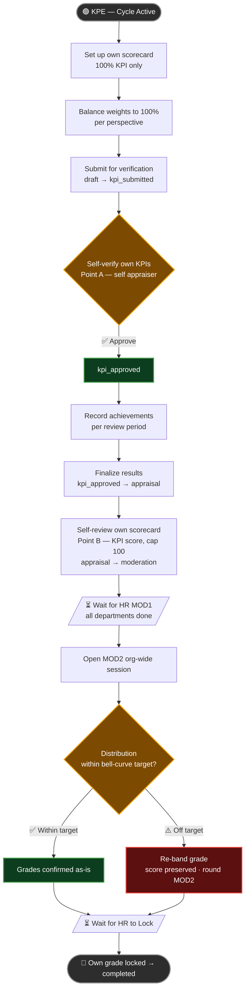
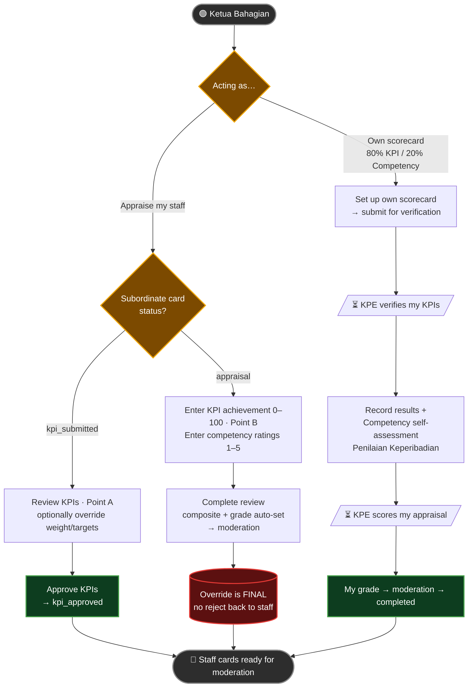
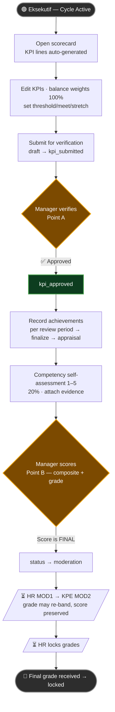
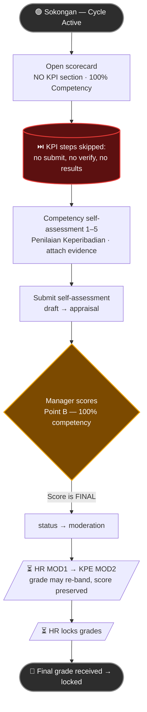
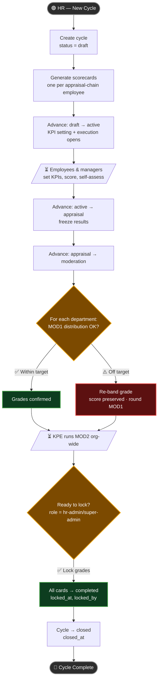

# 🔄 PNSB BSC KPI — Per-Role Process Flow

> One flowchart **per role**, each with pseudocode + a Mermaid diagram, so every actor can follow their own
> journey through an appraisal cycle.
> Rendered with Mermaid — open in any Mermaid-compatible viewer (VS Code, GitHub, Obsidian, etc.)

---

## Glossary (Abbreviations Used)

| Abbreviation      | Full Form                                           | Meaning                                                          |
| ----------------- | --------------------------------------------------- | ---------------------------------------------------------------- |
| **PNSB**    | Permodalan Negeri Selangor Berhad                   | The company                                                      |
| **BSC**     | Balanced Scorecard / Kad Skor Imbangan              | Strategic performance framework with 4 perspectives              |
| **KPI**     | Key Performance Indicator / Petunjuk Prestasi Utama | Measurable target assigned to each staff                         |
| **ALP**     | Ahli Lembaga Pengarah                               | Board of Directors — highest approval authority                 |
| **KPE**     | Ketua Pegawai Eksekutif                             | Chief Executive Officer (CEO)                                    |
| **HOD**     | Head of Department / Ketua Bahagian                 | Division/department head                                         |
| **HR**      | Human Resources / Bahagian Sumber Manusia           | HR department that administers the appraisal process             |
| **KB**      | Kakitangan Biasa                                    | General/Regular Staff group (pre-moderation scores)              |
| **MOD1**    | Moderasi Pertama (oleh HR)                          | First moderation round, conducted by HR — per department        |
| **MOD2**    | Moderasi Kedua (oleh KPE)                           | Second moderation round, conducted by the CEO — org-wide        |
| **Point A** | Verification                                        | Manager verifies/overrides KPI weight & targets at approval time |
| **Point B** | Appraisal Scoring                                   | Manager enters final KPI achievement & competency scores         |
| **KIV**     | Keep In View                                        | Pending — to be confirmed or scoped in a later phase            |

---

## Role → Category → Weighting Quick-Map

> How each role maps to its system `category`, Spatie `role`, and scoring split. This is what drives which
> steps appear in each flowchart below.

| Role (this doc)                 | System`category` | Spatie`role`         | KPI : Competency    | Special powers                                                          |
| ------------------------------- | ------------------ | ---------------------- | ------------------- | ----------------------------------------------------------------------- |
| **CEO / KPE**             | `ceo`            | `executive-director` | **100% : 0%** | No manager → self-appraises; runs**MOD2** org-wide               |
| **HOD / Ketua Bahagian**  | `executive`      | `division-head`      | **80% : 20%** | Is the`manager_id` of their staff → **appraises subordinates** |
| **Executive / Eksekutif** | `executive`      | `staff`              | **80% : 20%** | Standard full KPI + competency journey                                  |
| **Support / Sokongan**    | `support`        | `staff`              | **0% : 100%** | **Skips entire KPI workflow** — competency only                  |
| **HR Admin**              | — (role-based)    | `hr-admin`           | —                  | Opens/advances cycle, runs**MOD1**, **locks** grades        |

**Scorecard status flow:** `draft → kpi_submitted → kpi_approved → appraisal → moderation → completed → locked`
*(Support fast-tracks `draft → appraisal`, skipping `kpi_submitted` / `kpi_approved`.)*

**Cycle phase flow:** `draft → active → appraisal → moderation → closed`

**Grade bands (auto from final_score):** `≥90` Cemerlang · `76–89` Sangat Baik · `60–75` Baik · `50–59` Memuaskan · `<50` Perlu Diperbaiki

---

## 1️⃣ CEO / KPE (Ketua Pegawai Eksekutif)

> 100% KPI, no manager → **self-appraises as board proxy**. After everyone is graded, the KPE runs the
> **org-wide MOD2** moderation, then waits for HR to lock.

**Pseudocode**

```
ON cycle.status == active:
    setUpOwnScorecard()                      // KPI lines only (100% KPI)
    balanceWeightsTo100()  PER perspective
    submitForVerification()                  // status: draft -> kpi_submitted
    selfVerifyOwnKpis()                      // isSelfAppraiser == true; status -> kpi_approved
                                             //   (Point A: may override own weight/targets)

ON results window open (kpi_approved):
    FOR EACH review_period:
        recordAchievement(0..100)
    finalizeResults()                        // status -> appraisal

ON appraisal:
    selfReviewOwnScorecard()                 // Point B: KPI score, cap 100; status -> moderation

ON cycle.status == moderation:
    WAIT until HR completes MOD1 (all departments)
    openMod2OrgWideSession()
    FOR EACH graded scorecard org-wide:
        IF distribution off target:
            reBandGrade(before -> after)     // score preserved, logged round = MOD2
    // no self-moderation of own card

ON HR locks grades:
    receiveFinalGrade()                      // status -> completed, then locked
```

**Flowchart**



---

## 2️⃣ HOD / Ketua Bahagian (Division Head)

> Wears **two hats**: (a) their own 80/20 scorecard journey, and (b) as the `manager_id` of their staff, they
> **verify and score subordinates**. Manager override at appraisal is **final** — no rejection back to the employee.

**Pseudocode**

```
// ---- HAT A: own scorecard (category executive, 80% KPI / 20% competency) ----
ON cycle.status == active:
    setUpOwnScorecard(); submitForVerification()   // draft -> kpi_submitted
    WAIT manager(=KPE) verifies                     // -> kpi_approved
    recordResults(); selfAssessCompetencies(1..5)   // attach evidence
    WAIT manager(=KPE) scores appraisal             // -> moderation -> completed

// ---- HAT B: as appraiser of own subordinates ----
ON subordinate.scorecard.status == kpi_submitted:
    openApproval(subordinate)
    reviewKpis()
    optionally overrideWeightAndTargets()           // Point A, stage = verification, logged
    approveKpis()                                   // -> kpi_approved  (no reject-back path used)

ON subordinate.scorecard.status == appraisal:
    enterKpiAchievement(0..100)                     // Point B, override logged if differs
    enterCompetencyRatings(1..5)                    // self-rating shown as reference only
    completeReview()                                // composite + grade auto-set; -> moderation
    // override is FINAL — no rejection back to employee
```

**Flowchart**



---

## 3️⃣ Executive / Eksekutif

> Standard staff member, **80% KPI / 20% competency**. Full journey: set KPIs → manager-approved → record
> results → competency self-assessment → manager scores → moderation → final grade.

**Pseudocode**

```
ON cycle.status == active:
    openScorecard()                          // KPI lines auto-generated from library
    editKpis(); balanceWeightsTo100()        // per perspective
    setThresholdMeetStretch() FOR each KPI
    submitForVerification()                  // status: draft -> kpi_submitted

WAIT manager verifies (Point A)              // status -> kpi_approved

ON kpi_approved:
    FOR EACH review_period: recordAchievement(0..100)
    finalizeResults()                        // status -> appraisal
    selfAssessCompetencies(rate 1..5)        // 20% section; attach evidence files

WAIT manager scores (Point B)                // composite + grade; status -> moderation
WAIT HR MOD1 + KPE MOD2                       // grade may be re-banded (score preserved)
WAIT HR lock                                 // status -> completed -> locked
receiveFinalGrade()
```

**Flowchart**



---

## 4️⃣ Support / Sokongan & Teknikal

> **0% KPI / 100% competency** — **fast-track**. No KPI setup, no submit-for-verification, no results window.
> Goes straight to competency self-assessment, then manager scores, then moderation.

**Pseudocode**

```
ON cycle.status == active:
    openScorecard()                          // NO KPI lines (KPI weight = 0)
    selfAssessCompetencies(rate 1..5)        // 100% competency
    attachEvidenceFiles()
    submitSelfAssessment()                   // status: draft -> appraisal  (skips kpi_submitted/kpi_approved)

WAIT manager scores (Point B)                // 100% competency composite + grade; status -> moderation
WAIT HR MOD1 + KPE MOD2                       // grade may be re-banded (score preserved)
WAIT HR lock                                 // status -> completed -> locked
receiveFinalGrade()
```

**Flowchart**



---

## 5️⃣ HR Admin (Bahagian Sumber Manusia)

> Drives the whole cycle: opens it, generates scorecards, advances phases, runs **MOD1 per department**,
> waits for the KPE's **MOD2**, then **locks** grades to close the cycle.

**Pseudocode**

```
createCycle()                                // cycle.status = draft
generateScorecards()                         // one per appraisal-chain employee
advancePhase(): draft -> active              // KPI setting + execution window opens

// ... employees & managers work through their cards ...
advancePhase(): active -> appraisal          // freeze results; managers finish scoring
advancePhase(): appraisal -> moderation      // grades enter calibration

FOR EACH department:
    openMod1Session(department)
    compareActualVsBellCurveTarget()
    IF distribution off target:
        reBandGrade(before -> after)         // score preserved, logged round = MOD1

WAIT KPE completes MOD2 (org-wide)

IF cycle.status == moderation AND role in [super-admin, hr-admin]:
    lockGrades()                             // all scorecards -> completed (locked_at, locked_by)
                                             // cycle.status -> closed (closed_at)
```

**Flowchart**



---

## Bell Curve Target Reference (for Moderation — Sesi Moderasi)

> Based on 91 total Kakitangan Biasa (KB / Regular Staff). Percentages scale per headcount each cycle.

| Kategori                             | Sasaran (Target) | % Target | Trigger for Moderation                            |
| ------------------------------------ | ---------------- | -------- | ------------------------------------------------- |
| Cemerlang (Excellent)                | 3                | ~3%      | If actual > 3, downgrade excess to Sangat Baik    |
| Sangat Baik (Very Good)              | 16               | ~18%     | If actual > 16, downgrade excess to Baik          |
| Baik (Good)                          | 61               | ~67%     | Bulk of staff should land here                    |
| Memuaskan (Satisfactory)             | 7                | ~8%      | If actual < 7, upgrade some from Perlu Diperbaiki |
| Perlu Diperbaiki (Needs Improvement) | 4                | ~4%      | Minimum maintained for accountability             |

---

## Rejection & Escalation Summary (Quick Reference)

| Stage                     | Who Verifies / Moderates     | What Happens                                     | Reject-back?                                        |
| ------------------------- | ---------------------------- | ------------------------------------------------ | --------------------------------------------------- |
| Individual KPI (Point A)  | Manager (HOD / KPE for self) | Verify; may override weight & targets, logged    | Approves forward — no formal reject path in-system |
| Appraisal Score (Point B) | Manager (HOD / KPE for self) | Enters final KPI achievement + competency rating | **No** — manager override is FINAL           |
| MOD1 — per department    | HR Admin                     | Re-band grades vs bell-curve; score preserved    | Adjusts grade only                                  |
| MOD2 — org-wide          | KPE (CEO)                    | Final org-wide re-band; score preserved          | Adjusts grade only                                  |
| Lock                      | HR Admin / Super Admin       | All cards → completed; cycle → closed          | Final — grades frozen                              |
