# 🔄 PNSB BSC KPI — Process Flow Diagram

> Full appraisal cycle flow including all rejection and revision paths.
> Rendered with Mermaid — open in any Mermaid-compatible viewer (VS Code, GitHub, Obsidian, etc.)

---

## Glossary (Abbreviations Used)

| Abbreviation | Full Form | Meaning |
|---|---|---|
| **PNSB** | Permodalan Negeri Selangor Berhad | The company |
| **BSC** | Balanced Scorecard / Kad Skor Imbangan | Strategic performance framework with 4 perspectives |
| **KPI** | Key Performance Indicator / Petunjuk Prestasi Utama | Measurable target assigned to each staff |
| **ALP** | Ahli Lembaga Pengarah | Board of Directors — highest approval authority |
| **KPE** | Ketua Pegawai Eksekutif | Chief Executive Officer (CEO) |
| **HR** | Human Resources / Bahagian Sumber Manusia | HR department that administers the appraisal process |
| **KB** | Kakitangan Biasa | General/Regular Staff group (pre-moderation scores) |
| **MOD1** | Moderasi Pertama (oleh HR) | First moderation round, conducted by HR |
| **MOD2** | Moderasi Kedua (oleh KPE) | Second moderation round, conducted by the CEO |
| **KIV** | Keep In View | Pending — to be confirmed or scoped in a later phase |
| **TBC** | To Be Confirmed | Decision not yet finalised |

---

## Main Flow Diagram

```mermaid
flowchart TD
    START([🟢 Bahagian Sumber Manusia - HR\nOpens Appraisal Cycle]) --> PHASE1

    %% ─────────────────────────────────────────
    subgraph PHASE1 ["📋 Phase 1 — Company KPI Setting"]
        P1A[Prepare Company-Level KPI\nbased on strategic goals] --> P1B[Submit to Ahli Lembaga Pengarah\nALP - Board of Directors\nfor Approval]
        P1B --> P1C{Ahli Lembaga Pengarah\nALP Decision}
        P1C -->|✅ Approved| P1D[Company KPI Locked]
        P1C -->|❌ Rejected| P1E[Receive Rejection Feedback\nfrom Ahli Lembaga Pengarah - ALP]
        P1E --> P1F[Revise Company KPI\nwith ALP feedback]
        P1F --> P1B
    end

    P1D --> PHASE2

    %% ─────────────────────────────────────────
    subgraph PHASE2 ["👤 Phase 2 — Individual KPI Setting"]
        P2A[Cascade Company KPI\nto Department / Staff Level] --> P2B[Kakitangan - Staff\nPrepares Own Individual KPIs]
        P2B --> P2C[Submit KPI Form to\nKetua Pegawai Eksekutif - KPE\nor Ketua Bahagian - Department Head]
        P2C --> P2D{Ketua Pegawai Eksekutif - KPE\nor Ketua Bahagian Decision}
        P2D -->|✅ Approved| P2E[KPI Form Submitted to\nBahagian Sumber Manusia - HR\nKPIs Locked]
        P2D -->|❌ Rejected| P2F[Receive Rejection Feedback\nfrom KPE or Ketua Bahagian]
        P2F --> P2G{Rejection Type?}
        P2G -->|Minor — KPI needs tweaking| P2H[Staff Revises KPI\nand Resubmits]
        P2G -->|Major — Wrong perspective\nor incorrect weight| P2I[Ketua Bahagian Guides\nRevision Directly]
        P2H --> P2C
        P2I --> P2B
    end

    P2E --> PHASE3

    %% ─────────────────────────────────────────
    subgraph PHASE3 ["📅 Phase 3 — KPI Execution Period (Januari–Disember)"]
        P3A[KPI Cycle Active] --> P3B[Staff Executes KPIs\nThroughout the Year]
        P3B --> P3C[Log Achievements\nContinuously]
        P3C --> P3D{Mid-Year Check\nOptional — Keep In View KIV}
        P3D -->|On Track| P3E[Continue to Year-End]
        P3D -->|Off Track| P3F[Flag to Ketua Bahagian\nfor Coaching and Support]
        P3F --> P3C
        P3E --> P3G[Year-End: Staff Submits\nFinal Achievement Data\nto Bahagian Sumber Manusia - HR]
    end

    P3G --> PHASE4

    %% ─────────────────────────────────────────
    subgraph PHASE4 ["📊 Phase 4 — Sesi Penilaian Prestasi (Appraisal Session)"]
        P4PRE[Appraisal conducted under\nAhli Lembaga Pengarah - ALP\nformal guidelines and ketetapan\nScoring rules are ALP Board decisions\nnot system defaults] --> P4A

        P4A{Employee Category?}
        P4A -->|Ketua Pegawai Eksekutif - KPE\nALP ketetapan: 100% KPI| P4B[Pengurus - Manager Scores\nKPI Only - 100% weight]
        P4A -->|Eksekutif and Pengurusan Kanan\nALP ketetapan: 80% KPI plus 20% Competency| P4C[Pengurus - Manager Scores\n80% KPI plus 20% Penilaian Keperibadian]
        P4A -->|Sokongan and Teknikal\nALP ketetapan: 100% Competency| P4D[Pengurus - Manager Scores\nPenilaian Keperibadian Only - 100% weight]

        P4B --> P4E[Manager Reviews Staff KPI Achievement\nvs Ambangan / Setuju / Lebihan\nThreshold / Meet Target / Stretched]
        P4C --> P4E
        P4C --> P4F
        P4D --> P4F[Manager Rates Penilaian Keperibadian\nStaff Self-Rating visible to Manager\nManager enters own rating\nManager rating is final score]

        P4E --> P4G{Score Disputed\nby Staff?}
        P4G -->|✅ No Dispute| P4H[Initial Score Confirmed]
        P4G -->|⚠️ Disputed| P4I[Escalate to Bahagian\nSumber Manusia - HR\nfor Mediation]
        P4I --> P4J{HR Mediation Result}
        P4J -->|Score Stands| P4H
        P4J -->|Score Revised| P4H

        P4F --> P4H
    end

    P4H --> PHASE5

    %% ─────────────────────────────────────────
    subgraph PHASE5 ["⚖️ Phase 5 — Sesi Moderasi (Moderation Session)"]
        P5A[Ketua Bahagian and\nKetua Pegawai Eksekutif - KPE\nReview All Initial Grades] --> P5B[Check Against Bell Curve\nDistribution Targets]
        P5B --> P5C{Distribution\nWithin Target?}

        P5C -->|✅ Within Target| P5D[Grades Confirmed As-Is]

        P5C -->|⚠️ Too Many in Cemerlang| P5E[Downgrade Some:\nCemerlang → Sangat Baik]
        P5C -->|⚠️ Too Many in Sangat Baik| P5F[Downgrade Some:\nSangat Baik → Baik]
        P5C -->|⚠️ Too Few in Baik| P5G[Upgrade Some:\nMemuaskan → Baik]

        P5E --> P5H[Log All Moderation Changes\nin System]
        P5F --> P5H
        P5G --> P5H
        P5D --> P5H

        P5H --> P5I{Moderasi Kedua - MOD2\nKetua Pegawai Eksekutif - KPE\nFinal Review}
        P5I -->|✅ Approved| P5J[Final Grades Locked\nby Bahagian Sumber Manusia - HR]
        P5I -->|❌ Further Adjustment Needed| P5B
    end

    P5J --> PHASE6

    %% ─────────────────────────────────────────
    subgraph PHASE6 ["📢 Phase 6 — Communication & Cycle Close"]
        P6A[Bahagian Sumber Manusia - HR\nNotifies Staff of Final Grade] --> P6B{Staff\nAcknowledgement}
        P6B -->|✅ Acknowledged| P6C[Record Signed Off]
        P6B -->|⚠️ Staff Disputes\nFinal Grade| P6D[Staff Raises Formal Appeal\nto HR]
        P6D --> P6E{Formal Appeal Review\nby HR and Ketua Bahagian}
        P6E -->|Appeal Valid — Grade Revised| P6F[Grade Updated and Reissued\nto Staff]
        P6E -->|Appeal Rejected — Grade Stands| P6C
        P6F --> P6C
        P6C --> P6G[Appraisal Cycle Closed]
    end

    P6G --> END([🔴 Cycle Complete])

    %% ─────────────────────────────────────────
    %% Styling
    classDef decision fill:#7c4a00,color:#fff,stroke:#f0a500,stroke-width:2px
    classDef reject fill:#5c1010,color:#fff,stroke:#e53935,stroke-width:2px
    classDef approve fill:#0d3d1f,color:#fff,stroke:#43a047,stroke-width:2px
    classDef terminal fill:#2d2d2d,color:#fff,stroke:#888,stroke-width:2px

    class P1C,P2D,P2G,P3D,P4A,P4G,P4J,P5C,P5I,P6B,P6E decision
    class P1E,P1F,P2F,P2G,P2H,P2I,P4I,P5E,P5F,P5G,P6D,P6E reject
    class P1D,P2E,P4H,P5D,P5J,P6C approve
    class START,END terminal
```

---

## Bell Curve Target Reference (for Moderation — Sesi Moderasi)

> Based on 91 total Kakitangan Biasa (KB / Regular Staff). Percentages scale per headcount each cycle.

| Kategori | Sasaran (Target) | % Target | Trigger for Moderation |
|---|---|---|---|
| Cemerlang (Excellent) | 3 | ~3% | If actual > 3, downgrade excess to Sangat Baik |
| Sangat Baik (Very Good) | 16 | ~18% | If actual > 16, downgrade excess to Baik |
| Baik (Good) | 61 | ~67% | Bulk of staff should land here |
| Memuaskan (Satisfactory) | 7 | ~8% | If actual < 7, upgrade some from Perlu Diperbaiki |
| Perlu Diperbaiki (Needs Improvement) | 4 | ~4% | Minimum maintained for accountability |

---

## Rejection & Escalation Summary (Quick Reference)

| Stage | Who Rejects / Escalates | Who Revises | Next Step |
|---|---|---|---|
| Company KPI | Ahli Lembaga Pengarah (ALP) | HR / Management | Revise & resubmit to ALP |
| Individual KPI — Minor | Ketua Pegawai Eksekutif (KPE) / Ketua Bahagian | Staff revises independently | Revise & resubmit |
| Individual KPI — Major | Ketua Pegawai Eksekutif (KPE) / Ketua Bahagian | Ketua Bahagian guides revision directly | Redo from start |
| Score Dispute (Appraisal) | Staff disputes manager's rating | Bahagian Sumber Manusia (HR) mediates | HR final decision |
| Bell Curve Off (Moderation) | Ketua Pegawai Eksekutif (KPE) finds distribution wrong | Ketua Bahagian adjusts grades | Recheck bell curve |
| Final Grade Appeal | Staff rejects final grade | HR + Ketua Bahagian reviews formally | Revised or stands |
